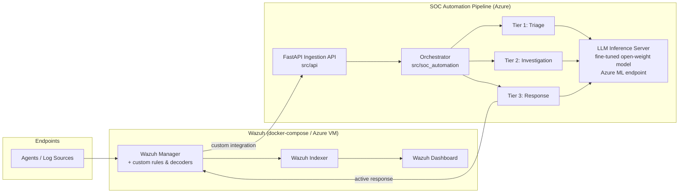

# Architecture

## Overview

## Components

### 1. Wazuh (SIEM/XDR)

- Deployed via `docker-compose.yml` locally, or provisioned on an Azure VM
  by `infra/modules/wazuh_compute` (cloud-init clones this repo and runs the
  same compose file — one definition of the stack, two places it runs).
- `wazuh/rules/local_ml_rules.xml` tags alerts eligible for the AI pipeline
  and assigns them a tier (`ml_pipeline_tier1/2/3` groups) based on
  correlation the Wazuh rule engine already does natively (frequency/timeframe
  rules), so the LLM isn't asked to do correlation Wazuh is already good at.
- `wazuh/integrations/ml_pipeline_integration.py` is a Wazuh custom
  integration script: the manager invokes it per matching alert and it
  forwards the alert JSON to the ingestion API.

### 2. Ingestion (`src/ingestion`)

`schema.py` flattens Wazuh's alert JSON into `NormalizedAlert`, and derives
the SOC tier from the rule groups the alert matched. `alert_listener.py`
is the single normalization entry point shared by the HTTP path
(`src/api/routers/alerts.py`) and any future queue-based ingestion path.

### 3. LLM (`src/llm`)

- **Fine-tuning** (`finetune/`): QLoRA fine-tunes an open-weight base model
  (default: Mistral-7B-Instruct) on historical, analyst-labeled incidents.
  `dataset_prep.py` turns labeled incidents into `{prompt, completion}`
  pairs using the *same* prompt templates (`inference/prompts.py`) the model
  is served at inference time, so training and serving never drift apart.
- **Inference** (`inference/`): a FastAPI server loads the base model + LoRA
  adapter once and exposes `/generate`. `client.py` is the thin HTTP client
  the automation layer uses, so tests can stub it out without a GPU.
- **Evaluation** (`evaluation/`): triage-accuracy against the held-out set,
  run after each fine-tuning job in CI.

### 4. SOC Automation (`src/soc_automation`)

- **Tier 1** — triage: classify true/false positive, summarize for a human.
- **Tier 2** — investigation: correlate related alerts, extract IOCs.
- **Tier 3** — response: recommend containment; only *auto-executes* above
  `CONFIDENCE_THRESHOLD` (0.85) — anything less queues for human approval,
  since a wrong Tier 3 action (isolating a host, disabling an account) is
  costly in a way a wrong Tier 1 summary is not.
- `orchestrator.py` routes an alert through the tiers, escalating Tier 1
  results with low self-reported confidence to Tier 2 regardless of which
  Wazuh rule group matched.

### 5. Infra (`infra/`, Terraform)

Modules: `networking` (VNet/NSG), `wazuh_compute` (the Wazuh VM),
`azure_ml` (workspace + autoscaling GPU compute cluster, min nodes = 0),
`storage` (fine-tuning data + model artifacts), `key_vault` (secrets).

### 6. CI/CD (`.github/workflows/`)

| Workflow | Trigger | Gated on secrets? |
|---|---|---|
| `ci.yml` | every push/PR | No — lint, unit+integration tests, `terraform validate` |
| `docker-build.yml` | push/PR touching `src/`/`docker/` | No to build; yes (`GITHUB_TOKEN`, automatic) to push to GHCR |
| `security-scan.yml` | push/PR + weekly | No |
| `codeql.yml` | push/PR + weekly | No |
| `terraform.yml` | push/PR touching `infra/` | Yes — `AZURE_CLIENT_ID`/`AZURE_TENANT_ID`/`AZURE_SUBSCRIPTION_ID` |
| `ml-training.yml` | push touching `src/llm/finetune` or `ml/data`, or manual | Yes — same Azure secrets |

The two Azure-gated workflows check for credentials first and print a
skip notice instead of failing when they're absent, so the repo is fully
mergeable before any cloud account is wired up. See `docs/deployment.md`
for the exact secrets to add.
